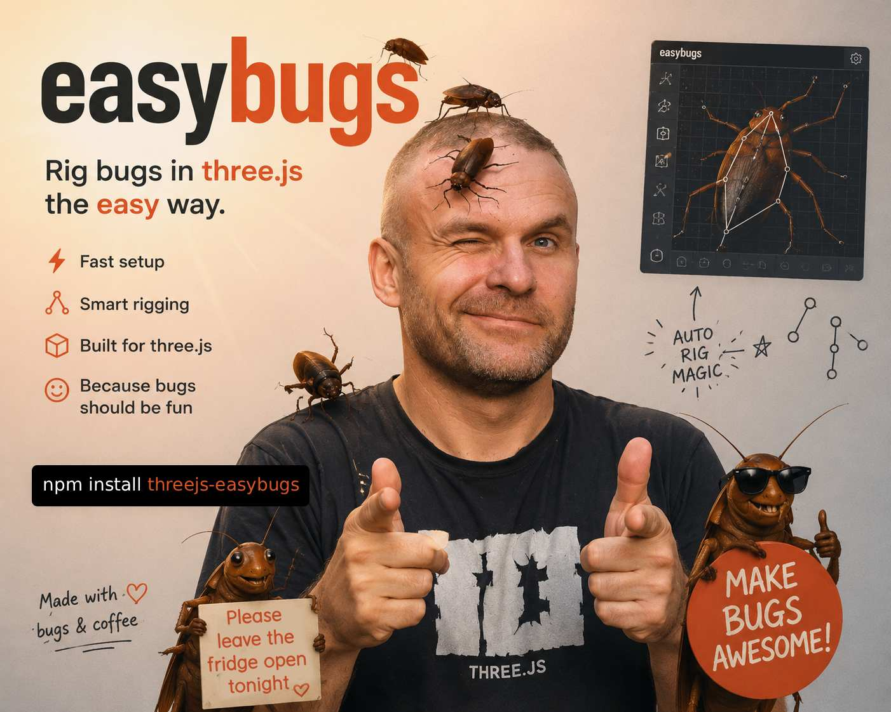
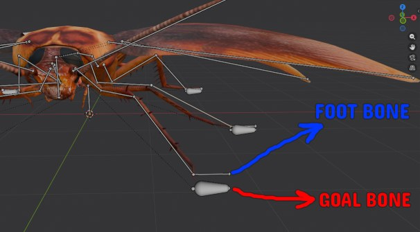

Live Demo: [https://bandinopla.github.io/threejs-easybugs/](https://bandinopla.github.io/threejs-easybugs/)
Source code: [demo/demo.ts](demo/demo.ts)

## 🤖 AI Docs: [Chat with the documentation](https://notebooklm.google.com/notebook/3e665ebe-47d8-4dd3-81dd-2d18eafa6d66) + Audio Guide

# What is this?
Easily setup a rig to create bugs that have many legs and will stick to the surface in which they are walking. They use the [CCDIKSolver](https://threejs.org/docs/?q=CCDIKSolver#CCDIKSolver) to adjust the skeleton of the bug to move the legs using IK so it looks somewhat realistic. Great for decorative props in games or to simulate creatures walking on surfaces with varying height!


## Features
- Works nicely in conjuntion with [InstancedAnimatedMesh](https://github.com/bandinopla/threejs-instancedanimatedmesh) to instantiate many bugs all sharing the same skeleton!
- Plug in your own movement behaviour
- Plug in your own raycast (ground finder) behaviour.
- Minimal API ( no need to remember much )
- Plug in your own [custom gait function](https://chatgpt.com/share/6a5e0827-0d8c-83e9-b9c0-cb8013ca4ff4)

## How does it work?
There are 2 parts:
1. The movement itself of the bug's body
2. [Optional] the IK of the legs to move along the surface...

You can skip the IK part if you don't care about the movement of the legs. The main bug's handler just focuses on moving on top of a surface.

### The surface
This implementation uses a "raycast cage" which basically means it expects a reference to a bounding box (empty object with non uniform scale and posibly even rotated) of the available area where the bugs can move AND the "strategy" to use to know how to cast rays to find the ground. 

Currently there are 2 build in strategies:
1. "DOME" : it will treate the bounding box as a dome, ignoring the bottom half. Rays are casted fromthe dome's surface inwards towards the center.
2. "BASIC" : a box where rays are thrown from the top to the base.


## Setup

Import the rigger: 

```js
import { BugRig } from "threejs-easybugs";
```
This is the rig's handler, it is not an object3d it just handles the internals to move the bug's body and optionally it's legs.

```js
// here body is just the Object3D of your bug, the thing that represent's the bug's potition. 
const bug = new BugRig(body, {
		collisionLayer: 2, //Layer to use to "hit the ground" where you put your collidable objects so the raycast ignores everything else
});

// Optional, configure how the legs will move:
bug.setupLegsIK({
			// rig: roachRig, ///<--- Optional, in case the rig is not inside of "body"
			legs: [
				{
					goal: "legAfootGoal.L", // name of the goal gone
					foot: "legAfoot.L", // name of the foot bone
					chainLength: 3, // how many bones are in the leg
					mirror: true, // will copy and rename .L to .R

					// Limits for the rotation of the bones. If not set, there are no limits
					//rotationMin: new Vector3(x,y,z) for the min rotation
					//rotationMax: new Vector3(x,y,z) for the max rotation
				},
				{
					goal: "legAfootgoal.L.001",
					foot: "legAfoot.L.001",
					chainLength: 3,
					mirror: true,
				},
				{
					goal: "legAfootgoal.L.002",
					foot: "legAfoot.L.002",
					chainLength: 3,
					mirror: true,
				},
			],
			iterations: 13, // how many the IK solver will run
			stepTransitionDuration: 0.1, //seconds taken to a leg to move from pointA to B
			footMaxDistanceFromGoal: 0.01, //distance the foot has to be from the goal to trigger a new step
		});

// the IK config from above will create a total of 6 legs

// here "dome" is just an empty object in stage scale and positioned where you want the bug to live inside of...
bug.setRaycastCage(dome, "dome");

// initialize the bug to a random location inside that raycast cage
bug.placeAtRandomPosition();

// and in your render loop...
bug.update( delta );
```

### The skeleton's rig
Your skeleton should:
* Have one goal bone per leg at the root of the armature.
* the foot bone is what will try to achieve the goal bone.
It works the same way as in blender's IK Constrain. In fact, it is advisable to setup an IK constraint on your skeleton so your animations respect the IK too during animation.



### Custom body behaviour
The bug by default will use a "random walk" behaviour to pick the next step to walk to. But you can define your own behaviour extending the `BugBehaviour` class:

```js
import { Object3D, Vector3 } from "three";
import { BugBehaviour } from "threejs-easybugs"; 

export class CustomBehaviourExample extends BugBehaviour {

	//
	// this is the method you override to pick a random point to walk next.
	// The "nextStep" shoudl be mutated bu you, and it is in the local space of the body.
	//
	protected override calculateNextStepFor(
		body: Object3D,
		nextStep: Vector3,
	): void {

		// for eaxample till will pick a point ahead by 3 units and to the right...

		nextStep.set(1, 0, 3);
	}
}

```
And you would assign your behaviour to your bug this way:
```js
yourBug.behaviour = new CustomBehaviourExample();
```
 


### Custom legs gait behaviour
A gait function tells the entire group of legs which leg and move and which leg has to stay in place. After the moving legs reach their next position, the gait function is called again to decide which legs have to move next and which legs have to stay in place. A gait can be as simple or complex as you want.

To define your own, in the `setupLegsIK` config define...

```js
bug.setupLegsIK({
	...
	gaitFunction: yourCustomGaitFunction
	...
});
``` 

It should be a generator function and will recieve a list of ik goal bones and should set to true/false the ones that can move and the ones that can't. Example:

```js
// THis will allow only 1 leg at a time...
function* yourCustomGaitFunction(bones: GaitBone[]) {
	let idx = 0;

	while (true) {
		bones[idx].canMove = true;
		yield;
		bones[idx].canMove = false;
		idx = (idx + 1) % bones.length;
	}
}
```


 

## Questions?
[@bandinopla](https://x.com/bandinopla)
